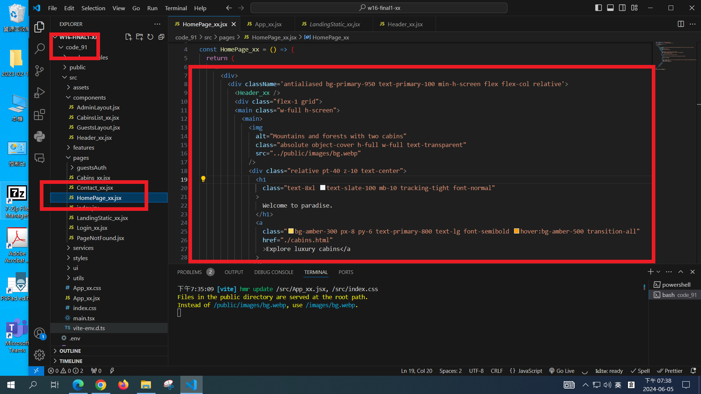
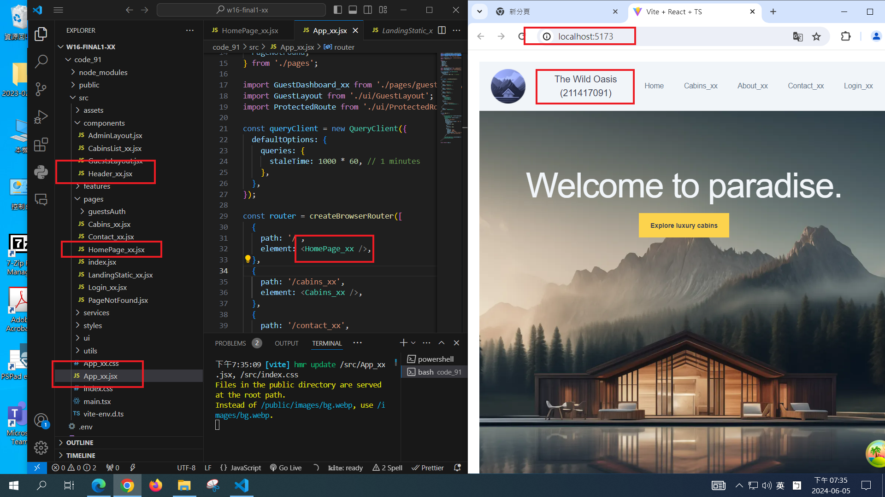

# (20%) Web 程式設計 2N 期末上機考-1

##### 2024-6-5 at E201

#### Note:

1. 請不要發揮同學愛，作弊雙方除了本次考試 0 分外，平常分數另扣 20 分，情節嚴重者會送校。
2. iClass 上請繳交 md_xx.zip (md 檔，所有圖片檔，pdf 檔)，及 code_xx.zip 兩個檔案 (node_modules 請刪除)，
3. 請直接將答案寫在 f1_xx.md 上，老師實作的圖片放在 f1_htc.pdf 上，請依照老師所給的圖片來實作並標註。
4. 跟期中考相關的檔案及目錄名稱有 xx 時，必須要改成學號後 2 碼，沒有修改時，會視違犯情況扣分。
5. 每一張圖片要有機房左側背景，圖片上要有你的學號(或後兩碼)，圖片標註要跟老師所標註的類似。違者會依情節扣分。
6. 有配分的每一題，都需要 git log 至 Github，沒有傳到 Github 者，會被扣該題 50%分數。
7. 請自評分數，將每一題的 ? 填入分數，沒有填者，不會批改，以 0 分計算。

##### Your (Name, ID): (?, ?)

##### final1 題目 (100%)

- P1 (20%): ? 分
- P2 (25%): ? 分
- P3 (25%): ? 分
- P4 (30%): ? 分

##### 總分: ? 分

---

## 注意：請依老師這次上機考所給的 code 開始撰寫，不可以寫在 w15 老師之前上課的 demo 中，因為整個檔案結構不一樣

## (20%) P1: 用老師所提供的 Wild Oasis theme，在瀏覽器根目錄，顯示 <HomePage_xx />　及本題檔案結構，如下圖


##### =>　

#### Your Answer

##### => <HomePage_xx /> 及<Header_xx /> 顯示與圖片有關主要的 code (有些展開，有些收起)。<Header_xx />在 P2, P3, P4 會用到，請寫成一個 component。



##### => 顯示 App_xx.jsx 本題之路由，並透過 Chrome 路由 / 顯示圖片 (左邊 code, 右邊圖)



##### => git log

```

```

---

#### (25%) P2: 點選 P1 圖片上的 Explore luxury cabins，透過路由 /cabins_xx，可以自 Supabase 抓取預設 8 筆 cabin 資料，這與點選選單項目 Cabins_xx 一樣，會得到一樣的結果。顯示如下圖。


##### => 在<Cabins_xx /> 上直接去呼叫 useCabins()，透過 React Query to 呼叫 apiCabins.jsx 取得 8 筆 cabins 資料


##### => 目錄及檔案結構如下


#### Your Answer

##### => Chrome 顯示如本題第一張圖


##### => 顯示 <Cabins_xx /> 完成本題主要的 code


##### => 顯示與本題有關 useCabins() 及 services/apiCabins 相關的 code


##### => git log

```

```

---

#### (25%) P3: 參考老師 w15 提供的 code，用路由 /login_xx 登入，用路由 /logout_xx 登出，登入帳號請以你在 Supabase 上已經建立有你學號的帳號。

老師這裡用的 Email 是 987654321@gmail.com, 密碼 13578642，你們必須要寫出本次考試登入時所用的帳號和密碼，方便老師或助教可以執行你們所寫的程式。

##### => 登入帳號及密碼


##### => 登入後，導向路由 /guest/dashboard_xx，呈現登入資訊如下三張圖


##### => 目錄及檔案結構如下


#### Your Answer

##### => 登入帳號及密碼


##### => 登入後，導向路由 /guest/dashboard_xx，呈現登入資訊如下三張圖


##### => 顯示 guestDashboard_xx.jsx 相關 code


##### => git log

```

```

---

#### (30%) P4: 實作 /contact_xx，一開始可以新增一筆訊息到 Supabasa，取得一個 messageId 後，可以編輯。

##### => 新增一筆訊息，按鈕是 Add Message，Supabase 端要有 messageId，可以透過呼叫 utils/helper.jsx 中的 createIdByDate()取得。


##### => 新增一筆訊息回傳結果，按鈕變成 Edit Message

將 Room Reservation 改成 Room Reservation -- make change
cabin 001 改成 cabin 003


##### => 可以看到已經改變


##### => 檢查 Supabase ，也已經改變


##### => 檔案目錄結構如下


#### Your Answer

請根據上述圖片作答

##### => 新增一筆訊息，按鈕是 Add Message


##### => 新增一筆訊息回傳結果，按鈕變成 Edit Message

將 Room Reservation 改成 Room Reservation -- make change
cabin 001 改成 cabin 003


##### => 可以看到已經改變


##### => 檢查 Supabase ，也已經改變


##### => 顯示 apiMessages.jsx code


##### => 顯示 Contact.jsx 相關 code


##### => git log

```

```

---
